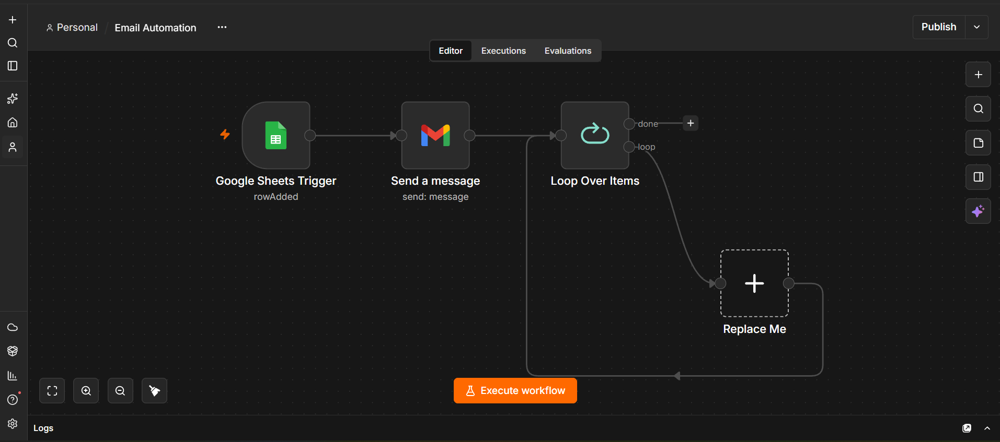

# 📧 Email Automation with n8n

An automated email workflow built with **n8n**, **Google Sheets**, and **Gmail**.

This project automates email communication by collecting data from Google Sheets and sending email messages automatically through Gmail.

---

## 🚀 Project Overview

Manual email sending can be repetitive and time-consuming, especially when dealing with multiple submissions or recipients.

This workflow uses **n8n** to automate the process.

### Workflow

```text
Google Sheets Trigger
        │
        ▼
   Send a Message
        │
        ▼
  Loop Over Items
        │
        ▼
 Process Each Item
        │
        └──────────────► Next Item

The workflow can be customized for registration confirmations, event communication, student notifications, application responses, and other email-based tasks.

✨ Features
📊 Google Sheets integration
📧 Gmail email automation
⚡ Automatic workflow execution
🔄 Loop-based item processing
📝 Dynamic email content
🤖 Reduces repetitive manual work
🔧 Easy to customize
🔐 Credentials are managed through n8n
🛠️ Technologies Used
Technology	Purpose
n8n	Workflow automation
Google Sheets	Data source
Gmail	Email delivery
JSON	Workflow export/import

📂 Repository Structure
email-automation-n8n/
│
├── README.md
│
├── workflow/
│   └── email-automation.json
│
└── screenshots/
    └── workflow-preview.png

🔄 How It Works
1. Google Sheets Trigger

The workflow starts when data is received from the connected Google Sheet.

The sheet can contain information such as:

Timestamp
Student Name
Registration ID
Student Email
mail_sent

The exact column names can be customized according to the project requirements.

2. Send a Message

The email node uses the information received from Google Sheets to send an email through Gmail.

Dynamic values can be inserted using n8n expressions.

For example:

{{$json["Student Email"]}}

This allows each email to be sent to the appropriate recipient.

3. Loop Over Items

The Loop Over Items node processes multiple items individually.

This makes the workflow suitable for processing multiple recipients and can be extended with delays or additional processing steps.

📋 Example Data

Example Google Sheets structure:

Timestamp	Student Name	Registration ID	Student Email	mail_sent
2026-09-01	Student One	241-35-101	student1@example.com	Yes
2026-09-01	Student Two	241-35-102	student2@example.com	Yes
2026-09-01	Student Three	241-35-103	student3@example.com	No

Example data is provided for demonstration purposes only.

⚙️ Setup
Prerequisites

Before importing the workflow, you will need:

An n8n instance
A Google account
A Google Sheet
A Gmail account
Google credentials configured in n8n
1. Download the Workflow

The exported n8n workflow is available here:

workflow/email-automation.json
2. Import into n8n

Open your n8n dashboard.

Go to:

Workflows
    ↓
Import from File

Select:

email-automation.json

The workflow will then appear in the n8n editor.

3. Configure Google Sheets

Open the Google Sheets Trigger node.

Connect your Google account and select:

Spreadsheet
Worksheet
Required trigger settings

Make sure the sheet contains the required columns.

4. Configure Gmail

Open the Send a Message node.

Connect your Gmail credentials through n8n.

Configure the required email fields:

To
Subject
Email Body

You can use n8n expressions to insert data dynamically.

Example:

To:
{{$json["Student Email"]}}
5. Test the Workflow

Add a test record to your Google Sheet.

Then execute the workflow in n8n.

Check that:

The Google Sheets Trigger receives the data.
The correct email address is detected.
The email content is generated correctly.
Gmail sends the message.
The workflow processes each item correctly.
🔐 Security

Never upload passwords, API keys, access tokens, or private credentials to GitHub.

Before publishing an exported n8n workflow:

Check the JSON file for sensitive information.
Remove private credentials or tokens if present.
Avoid uploading private student/customer information.
Use n8n's credential system for authentication.

This repository should contain only the workflow configuration and documentation required to understand or reproduce the automation.

🎯 Use Cases

This automation can be adapted for:

🎓 Student registration confirmations
📩 Event registration emails
🏫 University communication
📋 Form submission notifications
🧑‍💼 Application confirmations
🎟️ Event/ticket confirmations
📢 Automated announcements
📨 Follow-up emails
📊 Bulk email processing
🔧 Possible Improvements

The workflow can be extended with additional automation features.

Duplicate Email Protection

Check whether an email has already been sent before sending another email.

Example:

mail_sent = Yes

If the value is already Yes, the workflow can skip that record.

Email Delay

A delay can be added between emails when processing many recipients.

Loop Over Items
       ↓
   Send Email
       ↓
      Wait
       ↓
   Next Item
Email Status Logging

After successfully sending an email, the Google Sheet can be updated.

For example:

mail_sent = Yes

Additional fields can also be stored:

sent_at
email_status
error_message
Error Handling

An error workflow can be added to handle failed email deliveries.

Example:

Email Failed
     ↓
Record Error
     ↓
Update Google Sheet
     ↓
Notify Administrator

## 📸 Workflow Preview



🗺️ Roadmap
 Add duplicate email protection
 Add email sending delay
 Add successful-send logging
 Add failed-send handling
 Add HTML email templates
 Add automatic follow-up emails
 Add email statistics
 Improve error handling

👨‍💻 Author

Mahdiya1225

Built with:

n8n
Google Sheets
Gmail
⭐ About This Project

This project demonstrates how workflow automation can be used to reduce repetitive email-related tasks and create a more efficient communication process.

📄 License

This project is intended for educational and personal use.
